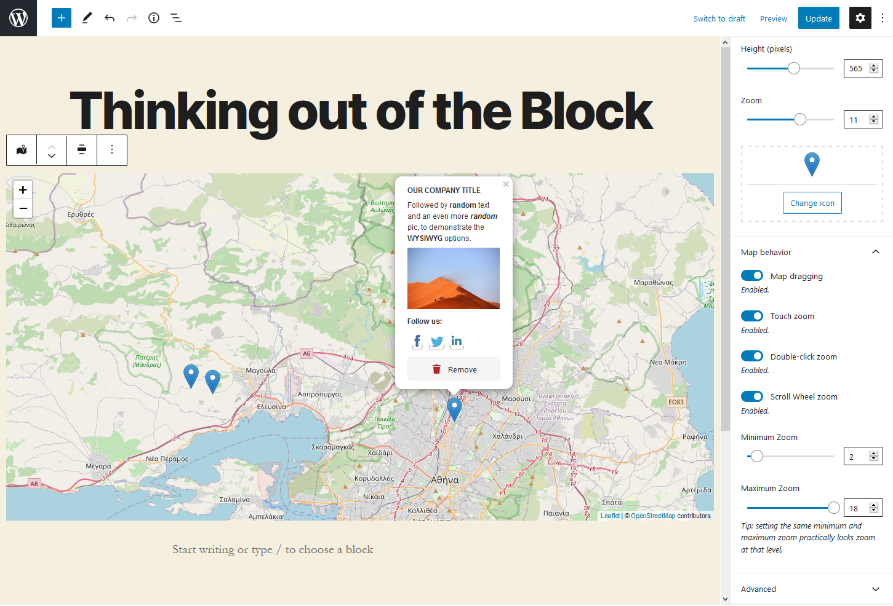

    
# Out of the Block: OpenStreetMap

A map block for WordPress' Gutenberg Editor which uses [OpenStreetMap](https://www.openstreetmap.org) and [Leaflet.js](http://https://leafletjs.com). It needs no API keys and works out of the box (or, out of the Block, if you prefer). Benefiting from Gutenberg's potential, the plugin tries a different take on how to add your locations on the map and rethinks a few things, UX-wise.

Instead of manually adding coordinates for each one of your markers, just click-and-drop them directly on the map. You want to adjust their position? Just drag them wherever you want. And instead of filling-in custom fields to set each marker's popup content, just open that popup and start writing in it, the Gutenberg way (it supports WYSIWYG editing, with links, images, and all). It even stores the map's zoom level as you use it so that you don't have to set it by hand.

👉 [Read more about the overall UX challenges](https://www.gsarigiannidis.gr/wordpress-gutenberg-map-block-openstreetmap/)

👉 [The challenges of building a user-friendly place search for OpenStreetMap](https://www.gsarigiannidis.gr/openstreetmap-place-search/)

### Features

* No need for API keys. Just install and use it.
* Support for multiple markers.
* [Dead-simple interface](https://www.gsarigiannidis.gr/wordpress-gutenberg-map-block-openstreetmap/). Don't search for coordinates and don't get overwhelmed by too many fields when using multiple markers. Just point and click on the map to add your marker where you want it and edit it's popup content directly from there.
* [Place search](https://www.gsarigiannidis.gr/openstreetmap-place-search/). Find locations by typing keywords.
* Remembers the zoom that you set when adding the markers and stores it so that you don't set it by hand (which you can do anyway if you prefer).
* Adjust the map height.
* Change the default marker icon with a custom one.
* Enable or disable map dragging.
* Enable or disable touch zoom.
* Enable or disable double-click zoom.
* Enable or disable scroll wheel zoom.
* Set a minimum and maximum limit that the user can zoom on the frontend. Setting the same value to both fields will lock the zoom at that level.

## Installation

1. Upload the plugin to your WordPress plugins directory and activate it.
2. That's it. You can go to a post/page that supports the Gutenberg editor and start using the block called "Out of the Block: OpenStreetMap"

## Frequently Asked Questions

### Do I need an API key, like with Google Maps?

No.

That's the point actually. Just install the plugin and start adding maps.

### How do I add a new location?

To add a location, left-click on the map for a while, until the cursor transforms from hand to crosshair. As long as the cursor is a crosshair, it means that releasing it will drop the marker at that spot. That slight delay has been added to prevent you from accidentally add markers all over the place with every click.

### How do I remove a location?

Click on the marker to open up its popup. There, you will see the "Remove" button.

### I can't find some of the options like disable dragging, setting zoom levels, etc

Check under the "Map behavior" section, at the blocks' settings at the sidebar on the right. It's toggled off by default, that's probably why you missed it.

## Screenshots

 
The map editing screen

 
Map behavior options

Adding a marker

Using custom markers

Place search
